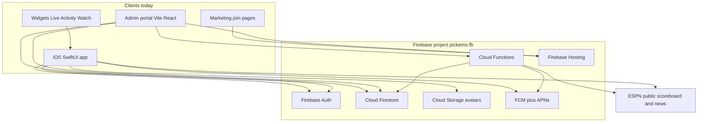
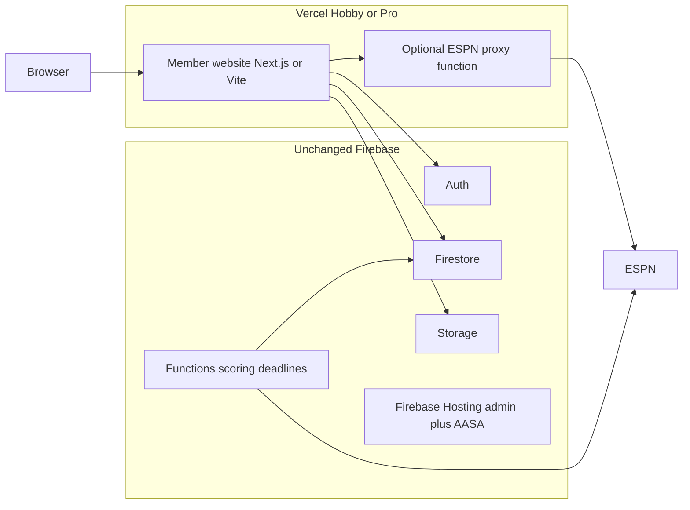

# Pickems web replica — architecture assessment

**Date:** 28 August 2026  
**Question:** If we replicated the entire current Pickems iOS app as a dedicated website to work in tandem with the iOS app, are we set up architecturally to support this? Context: Vercel Hobby plan is now available.

**Verdict:** Yes. The backend is already a multi-client Firebase system. A member-facing website would talk to the same Auth, Firestore, Storage, and Cloud Functions as iOS. Vercel would host the frontend only. It would not replace Firebase, and it is not required for the architecture to work.

The real cost is porting Swift client logic into a web app, plus a short list of platform glue (Apple Sign In on the web, authorized domains, ESPN CORS, push tokens, and `pickems.app` routing). Widgets, Live Activities, and Apple Watch have no web equivalent.

---

## 1. Bottom line

| Question | Answer |
|---|---|
| Can iOS and web share one backend? | **Yes.** Identity is Firebase UID. League data lives in Firestore. Scoring and deadlines run in Cloud Functions. |
| Do security rules block a browser client? | **No.** Rules check Auth, membership, and the `admin` custom claim. They do not check platform, bundle ID, or User-Agent. |
| Is there already a web client on this backend? | **Yes.** The admin portal (`firebase/admin`, Vite + React + Firebase JS SDK) already reads and writes Firestore from the browser. |
| Do we need a new REST API? | **No.** Firestore **is** the API. iOS never calls member Cloud Functions. |
| Does Vercel Hobby change the architecture? | **No.** Hobby is a place to deploy a static/SSR frontend. Data, auth, scoring, and push stay on Firebase (`pickems-fb`, Blaze with a $5 budget cap). |
| Can Hobby host a production Pickems site? | **Technically yes for a prototype.** Hobby is limited to **personal, non-commercial** use. Pickems is a published App Store product (Fannypack Inc.). Production should assume **Vercel Pro** or keep the site on **Firebase Hosting**, which already serves `web/` and the admin portal. |

---

## 2. How the system works today



**Pattern:** clients write Firestore documents. Cloud Functions react (materialize slate, lock, score, push). There is no custom member REST or GraphQL layer.

Evidence:

- iOS services talk straight to Firestore listeners (`Pickems/Core/Services/GroupService.swift`, `PickService.swift`, `ChatService.swift`, `AuthService.swift`).
- iOS does **not** import Firebase Functions / `httpsCallable`. Callables in `firebase/functions/src/admin.ts` are admin-portal-only.
- Hosting in `firebase/firebase.json` already serves the admin SPA plus `/join` and Apple App Site Association files.

### Identity

Same Firebase UID on every client.

1. Sign in with Apple **or** email/password → Firebase Auth `uid`.
2. Profile at `users/{uid}`.
3. Unique username via `handles/{normalizedKey}` transaction.
4. League membership on `groups/{groupId}.memberIds` and `groups/{groupId}/members/{uid}`.
5. Picks, nominations, chat, standings, career stats all keyed by that `uid`.

A website using the same Firebase project and Auth providers sees the same leagues and picks as the iOS app. Device-local UserDefaults (onboarding dismissed, chat blocklist, avatar color cache) would not sync unless reimplemented.

### What Cloud Functions already do for any client

| Function | Trigger | Role |
|---|---|---|
| `onWeekStatusChange` | week doc update | Materialize nominations → games; week-scored push |
| `onWeekCreated` | week created | Nudge commissioner for selection deadline |
| `selectionDeadlineJobs` | every 15 min | Selection deadline reminders; auto-open picking |
| `deadlineReminders` | every 15 min | 24h / 1h pick deadline reminders |
| `lockAndScoreWeeks` | every 5 min | Lock, ESPN score sync, standings, game-final / lead-change push |
| `autoCloseSeasons` | 15 Jan annually | Archive season, career stats |
| `syncPublicLeagueIndex` / `onPublicLeagueCreated` | group write | Discover index |
| `onMessageCreated` / `onReportCreated` | chat | Chat push + report counter / auto-hide |
| Admin callables | HTTPS callable | Portal repair / rescore / moderation — **not needed for members** |

A web user submitting a pick does not need a new server endpoint. They write the same `picks/{uid}` document iOS writes. `lockAndScoreWeeks` scores it either way.

---

## 3. Why this is already web-capable

### Security rules are client-agnostic

`firebase/firestore.rules` gates on `request.auth`, membership, commissioner, and `request.auth.token.admin == true`. Example: any signed-in client may read/write their own profile:

```
match /users/{userId} {
  allow read: if isSignedIn() && (request.auth.uid == userId || isSuperAdmin());
  allow create, update, delete: if isSignedIn() && request.auth.uid == userId;
}
```

No App Check is configured. No iOS-only server gate exists. `minimumBuild` in `appConfig/live` is enforced only in the iOS client (`LiveAppConfigService` / `ForceUpdateView`), not in rules or functions.

### A web Firebase app already exists

The admin portal (`firebase/admin/src/lib/firebase.ts`) uses a **web** Firebase app registration, not the iOS `GoogleService-Info.plist`. Comment in `firebase/admin/.env.example`:

> Do NOT hand-copy values out of GoogleService-Info.plist — the iOS and web apps are different Firebase apps with different appIds and API keys.

A member site would register a **second web app** (or reuse the existing web app) in the same project, add its origins to Auth authorized domains, and use the Firebase JS SDK the same way the portal does.

### Types are already mirrored in TypeScript

`firebase/admin/src/lib/types.ts` documents itself as a mirror of `Pickems/Core/Models/DomainModels.swift` and `GroupRules.swift`. That file is the starting point for a member web client. Firestore hooks in `firebase/admin/src/hooks/useFirestore.ts` show the listener pattern.

### Existing web surfaces (not a member app)

| Surface | Stack | URL / path | What it is |
|---|---|---|---|
| Marketing homepage | Static HTML | `web/index.html` → `https://pickems.app/` | App Store landing |
| Invite landing | Static HTML | `web/join.html` → `/join?code=` | Tries `pickems://join`, falls back to App Store |
| Admin portal | Vite + React 18 + Firebase JS 10 | `firebase/admin` on Firebase Hosting | Super-admin only |
| AASA | JSON | `web/.well-known/apple-app-site-association` | Universal Links for `/join` only |

There is **no Next.js, no Vercel config, and no member-facing SPA** today.

---

## 4. Vercel Hobby vs what we already have

Vercel is a **frontend host**. It does not hold league data.



### What Hobby is good for

- Deploy a Next.js or Vite SPA at a `*.vercel.app` URL, then attach `pickems.app` or a subdomain (`app.pickems.app`).
- Optional serverless proxy if the ESPN scoreboard API blocks browser CORS (iOS does not need CORS; browsers do).
- Preview deploys per PR.

A well-designed member site would keep **almost all traffic on the Firebase JS SDK** (Auth + Firestore listeners). That means Vercel function usage stays low unless you proxy ESPN or SSR a lot.

### Hobby constraints that matter

| Constraint | Why it matters for Pickems |
|---|---|
| **Personal / non-commercial only** | Pickems is a live App Store app under Fannypack Inc. Hobby TOS is a product/legal issue, not a tech issue. |
| Fair-use ~100 GB Fast Data Transfer / ~10 GB origin | Fine for a small SPA. Breaks down if you proxy lots of ESPN JSON or optimize many images on Vercel. |
| Exceeding limits **pauses** the feature (~30 days); no overage billing | A Saturday traffic spike could take the site down until the window resets. Pro can pay for overage. |
| No team collaboration on Hobby | Fine for a solo operator; not fine if multiple people ship the site. |
| 1M function invocations / 4 CPU-hrs | Irrelevant if the site is a static SPA talking to Firestore. Relevant if every scoreboard poll hits a Vercel function. |

**Recommendation:** treat Hobby as a **dev/preview** host. For a public member site, either upgrade to **Vercel Pro** or deploy the member SPA on **Firebase Hosting** next to (or instead of) the current marketing pages. Firebase Hosting is already paid for on Blaze.

### Domain split (do this even if Vercel is unused)

Keep concerns on separate hosts so Universal Links and the admin portal do not collide with a catch-all SPA.

| Host | Role |
|---|---|
| `pickems.app` or `app.pickems.app` | Member website (Vercel **or** second Firebase Hosting target) |
| `pickems-fb.web.app` | Admin portal + AASA + `/join` fallback (keep as-is unless you migrate carefully) |
| iOS associated domains | Already: `pickems.app`, `pickems-fb.web.app`, `pickems-fb.firebaseapp.com` |

If the member app lives at `pickems.app`:

- Serve AASA from that domain (`/.well-known/apple-app-site-association`) or iOS Universal Links break.
- `/join?code=` must keep working for people without the app **and** for people with the app (current `join.html` + AASA paths `/join`, `/join/*`).
- Do not put the admin SPA behind the same `** → index.html` rewrite as members; admins should stay on `pickems-fb.web.app` (or `admin.pickems.app`).

`DeepLinkRouter.swift` already treats `pickems.app` and `www.pickems.app` as Universal Link hosts. Route names to keep in parity: `/join`, `/pickems`, `/selections`, `/live`, `/leagues`, `/discover` (plus `?code=` / `?group=`).

---

## 5. Feature parity — iOS vs web

Legend: **shared backend** = same Firestore/Auth, web UI only. **web glue** = doable, different implementation. **iOS-only** = skip.

### Shared backend (this is most of the product)

Auth (email/password), profile, avatars, create/join league, invite codes, Selections, Pickems (spreads, confidence, late picks), leaderboards, multi-league switch, pick history, group picks board, commissioner settings, close season / dynasty data, discover public leagues, rivalry H2H, week awards data, group chat, mute/report, ESPN scoreboard/news (if CORS solved), favorite-team theming, help copy.

### Web glue required

| Gap | Why |
|---|---|
| Sign in with Apple on the web | iOS uses native `ASAuthorization`. Web needs a Services ID, return URL, and Firebase Apple provider for web (redirect or popup). Email/password already works in the admin portal. |
| Firebase Auth authorized domains | Add `*.vercel.app`, the production hostname, and localhost. |
| Register a Firebase **Web** app | Separate `appId` / API key from iOS. |
| Port Swift services | `GroupService`, `PickService`, `ChatService`, `AuthService`, `ESPNService`, engines. No shared package today — logic is duplicated by design (iOS Codable vs TS types). |
| ESPN from the browser | `site.api.espn.com` is called natively from iOS. Browsers typically hit CORS. Options: Vercel rewrite/proxy, a Cloud Function `onRequest`, or show scores only from Firestore after `lockAndScoreWeeks` (live Home scoreboard would be weaker). |
| Web push | Functions send FCM with an **APNs** payload and read a **single** `users/{uid}.fcmToken`. Last device wins. Web needs FCM web push + a token list (or web users get no deadline/chat/score pushes). |
| Share cards / Web Share / X OAuth | iMessage compose is iOS-only. Image cards and X callback URLs need web redirect URIs. |
| Scrimmage tutorial | Local-only `ScrimmageEngine` — reimplement or omit. |
| Charts | Swift Charts → a web chart library. Data is already in Firestore. |
| Crashlytics | Use a web APM if you want parity. |

### iOS-only (do not block a website)

Home Screen widgets, Live Activities / Dynamic Island, Apple Watch, App Group snapshot sync, haptics, `pickems://` custom scheme, App Store force-update screen, native Apple button chrome, iMessage share sheet.

There is **no StoreKit / Apple Pay / IAP** in the iOS app today, so payments are not an architecture constraint.

---

## 6. Gaps that are small on paper and easy to get wrong

### 6.1 Push token collision

`firebase/functions/src/notifications.ts` reads `users/{uid}.fcmToken` and sends with `apns` only. If a website overwrites that field with a web push token, **iOS pushes break**. If it never writes a token, web users get no pushes.

Fix when building the site: store `fcmTokens: { ios?: string, web?: string }` (or an array) and send both APNs and `webpush` payloads. Until then, the website can ship without push.

### 6.2 Client write contract

Because there is no member API, the website must write **exactly** the fields iOS writes, or rules reject the update and/or Cloud Functions mis-score. Field-level allow-lists in `firestore.rules` are strict (week status transitions, spread-only game edits, invite-code shape, handle docs).

Source of truth for shapes: `Pickems/Core/Models/DomainModels.swift` and `firebase/admin/src/lib/types.ts`. Treat a mismatch as a Saturday-breaking bug, same as an admin portal repair that the iOS decoder cannot read.

### 6.3 Read cost on the $5 Blaze cap

README: Firebase Blaze with a **$5 budget cap**. Live listeners on Home, Selections, Pickems, chat, and ESPN polling are the expensive part. A second client that keeps the same listeners open **while the iOS app is also open** can roughly double reads for that user. Design the web app to detach listeners when a tab is backgrounded, and do not poll ESPN every few seconds from every open tab (cache or proxy with TTL).

### 6.4 Attack surface

No App Check. A public website makes the Firebase API key trivial to copy (it already is in the admin bundle). The actual boundary is Firestore rules. Before a public member site: audit rules for the member write paths the new UI will exercise, and consider App Check (Apple + reCAPTCHA) so a scraped key cannot hammer writes. That would be a **new** backend change; it is not required for a prototype.

### 6.5 `join.html` vs a real web join flow

Today `/join?code=` is an App Store funnel. A tandem website should let a signed-in browser user **join in the browser**, and still offer “Open in the iOS app”. That is a product decision, not a backend limitation. Invite lookup already works for any signed-in client (`inviteCodes` get-by-code).

---

## 7. Recommended architecture if you build it

Do **not** put league writes on Vercel serverless. Keep the iOS pattern:

1. Browser → Firebase Auth (email + Apple web).
2. Browser → Firestore listeners/transactions for groups, weeks, picks, chat, profile.
3. Browser → Storage for avatars (`avatars/{uid}.jpg`, existing rules).
4. Cloud Functions continue to lock, score, and push.
5. Vercel (or Firebase Hosting) serves HTML/JS and optionally proxies ESPN.

Optional later: extract shared TypeScript types from `firebase/admin/src/lib/types.ts` into a package both admin and member apps import. Do not try to share Swift and TS from one source unless you invest in a codegen pipeline; the admin portal already accepted duplication.

**Stack that matches this repo:** Vite + React + Firebase JS SDK (same as `firebase/admin`). Next.js on Vercel is also fine if you want file-based routing and a tiny ESPN proxy route. Neither requires backend changes.

**What not to replicate on the website:** widgets, Live Activities, Watch, force-update gate, iMessage. Full visual parity with every Cover Moment / haptic is optional.

---

## 8. Checklist before a public tandem site

Backend (mostly console + small functions change, not a rewrite):

- [ ] Firebase Console: Auth → authorized domains include production web origin and Vercel previews if used.
- [ ] Apple Developer: Services ID + return URLs for Sign in with Apple on the web; enable the Apple provider for the web app in Firebase Auth.
- [ ] Decide push: skip for v1, **or** change `users/{uid}` token shape and `notifications.ts` to send APNs + webpush without clobbering iOS.
- [ ] Decide ESPN: proxy vs Firestore-only live scores.
- [ ] Keep admin portal and AASA reachable; do not swallow them in a member SPA rewrite.
- [ ] Confirm `pickems.app` DNS: Vercel vs Firebase Hosting vs split (`app.` vs apex).

Product / client (the actual project):

- [ ] Port member flows: auth, onboarding, leagues, selections, pickems, standings, commissioner, chat, profile, discover.
- [ ] Match Firestore write shapes to iOS / `types.ts`.
- [ ] Join links work in both the browser and the iOS app.
- [ ] Hobby vs Pro vs Firebase Hosting decision for production TOS and uptime.

---

## 9. Direct answers

**Are we set up architecturally?**  
Yes. Pickems is Firebase-first and client-agnostic. The admin portal already proves a browser can use this project. A member website is a new client on an existing backend, not a new backend.

**Does Vercel Hobby get us there?**  
Hobby can host a prototype frontend. It does not provide the database, auth, scoring, or push. For a public site attached to the App Store product, assume Pro or Firebase Hosting because Hobby is non-commercial and pauses on quota.

**What would block “entire current app” parity?**  
Not the backend. Widgets, Live Activities, Watch, and native push/APNs are iOS-only. Everything that lives in Firestore can work in tandem on day one if the web client writes the same documents.

**Largest engineering item?**  
Reimplementing iOS service-layer behavior in TypeScript with strict fidelity to `firestore.rules` and the existing document shapes — then verifying a Saturday: nominate, pick, lock, score, standings, chat, with both clients in the same league.

---

## 10. Key file map

| Area | Path |
|---|---|
| Firestore rules | `firebase/firestore.rules` |
| Functions (lock/score/push) | `firebase/functions/src/index.ts` |
| Push sender (single `fcmToken` + APNs) | `firebase/functions/src/notifications.ts` |
| Admin callables | `firebase/functions/src/admin.ts` |
| TS document types | `firebase/admin/src/lib/types.ts` |
| Web Firebase config | `firebase/admin/.env.example`, `firebase/admin/src/lib/firebase.ts` |
| Hosting / AASA / join | `firebase/firebase.json`, `firebase/scripts/stage-hosting.sh`, `web/` |
| iOS paths | `Pickems/Core/Networking/FirestorePaths.swift` |
| iOS services | `Pickems/Core/Services/*.swift` |
| Deep links | `Pickems/Core/Utilities/DeepLinkRouter.swift` |
| Marketing + invite HTML | `web/index.html`, `web/join.html` |
| Admin portal SOP | `docs/ADMIN_PORTAL_SOP.md` |
